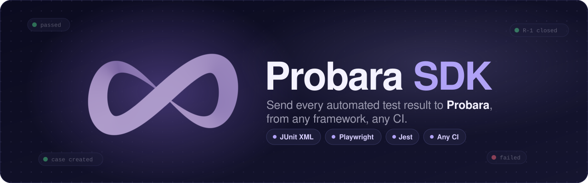
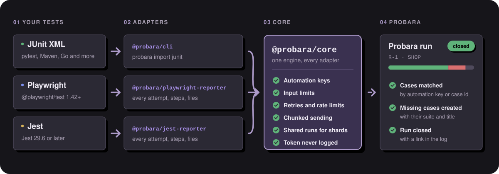

<a id="top"></a>

<p align="center">
  <a href="https://probara.net">
    
  </a>
</p>

<p align="center">
  <a href="https://github.com/cynch-me/probara-sdk/actions/workflows/ci.yml"></a>
  <a href="https://www.npmjs.com/package/@probara/cli"></a>
  <a href="LICENSE"></a>
  <a href=".nvmrc"></a>
  <a href="tsconfig.base.json"></a>
  <a href="CONTRIBUTING.md"></a>
</p>

<p align="center">
  <a href="https://probara.net"><b>Website</b></a>
  ·
  <a href="https://docs.probara.net"><b>Probara docs</b></a>
  ·
  <a href="#quick-start"><b>Quick start</b></a>
  ·
  <a href="#packages"><b>Packages</b></a>
  ·
  <a href="#ci-guides"><b>CI guides</b></a>
  ·
  <a href="https://docs.probara.net/openapi/v1.json"><b>API reference</b></a>
  ·
  <a href="#contributing"><b>Contributing</b></a>
</p>

<br>

**Probara SDK** sends your automated test results to [Probara](https://probara.net), from any
framework and any CI. Every result lands in a Probara run, linked to its test case by an automation
key. Missing cases are created, and the run closes once every result is in. Open source, under
Apache 2.0.

<p align="center">
  
</p>

## Why Probara SDK

<table>
  <tr>
    <td width="33%" valign="top">
      <b>🛡️ Never breaks your tests</b><br>
      The reporters never throw into Playwright or Jest and never change their exit code. The CLI
      fails a step on a reporting problem, never on a failed test.
    </td>
    <td width="33%" valign="top">
      <b>🔐 The token stays secret</b><br>
      The CLI and the reporters read it from the environment only (there is no
      <code>--token</code> flag), and every log line, error and summary is redacted against it.
    </td>
    <td width="33%" valign="top">
      <b>🔗 Results find their cases</b><br>
      A stable automation key, or a case id such as <code>SHOP-12</code> in the name, links each
      test to its case. Missing cases are created.
    </td>
  </tr>
  <tr>
    <td width="33%" valign="top">
      <b>🔁 Every attempt counts</b><br>
      The reporters send one result per attempt, retries included, with its steps, errors and
      attachments, Playwright's screenshots and traces too.
    </td>
    <td width="33%" valign="top">
      <b>🧩 One run for every shard</b><br>
      Sharded CI jobs report into one run: <code>probara run create</code> before the shards,
      <code>probara run close</code> after the last one.
    </td>
    <td width="33%" valign="top">
      <b>📦 Nothing gets lost</b><br>
      Results are sent in chunks, with retries and timeouts. What a reporter could not send can be
      kept in a file and sent later with <code>probara import results</code>.
    </td>
  </tr>
  <tr>
    <td width="33%" valign="top">
      <b>🧪 Any JUnit XML</b><br>
      The CLI detects the dialect of Jest, pytest, Playwright, Maven Surefire and gotestsum per file,
      and reads any other JUnit report.
    </td>
    <td width="33%" valign="top">
      <b>🚀 Any CI</b><br>
      Ready-made guides for GitHub Actions, GitLab CI, CircleCI, Azure Pipelines, Bitbucket
      Pipelines, Buildkite and Jenkins.
    </td>
    <td width="33%" valign="top">
      <b>🪶 Light by design</b><br>
      <code>@probara/core</code> has no runtime dependencies. Adapters only translate their source
      into core results.
    </td>
  </tr>
</table>

## Quick start

Every path needs a Probara app token, created from the card of your tool in **Integrations**, and
the code of the project to report into (such as `SHOP`). Reporting from CI needs a paid plan.

<details open>
<summary><b>CLI</b>: import JUnit XML from any framework</summary>

<br>

Keep the token in the environment:

```bash
export PROBARA_API_TOKEN="probara_app_your_token"
export PROBARA_PROJECT=SHOP
```

Check what would be sent (a dry run needs no token and sends nothing), then import the report:

```bash
probara import junit junit.xml --dry-run
probara import junit junit.xml
```

Without installing, run `npx @probara/cli` instead of `probara`.
**[Read the CLI guide →](packages/cli/README.md)**

</details>

<details>
<summary><b>Playwright</b>: a reporter that sends every attempt</summary>

<br>

```bash
npm i -D @probara/playwright-reporter
```

Add the reporter next to the one you read in the terminal:

```ts
// playwright.config.ts
import { defineConfig } from '@playwright/test';

export default defineConfig({
  reporter: [['list'], ['@probara/playwright-reporter', { projectId: 'SHOP' }]],
});
```

Run your tests with `PROBARA_API_TOKEN` in the environment. Without a token the reporter stays off
and quiet. **[Read the Playwright guide →](packages/playwright-reporter/README.md)**

</details>

<details>
<summary><b>Jest</b>: a reporter that sends every attempt</summary>

<br>

```bash
npm install --save-dev @probara/jest-reporter
```

Add the reporter after `default`, the one you read in the terminal:

```js
// jest.config.js
module.exports = {
  reporters: ['default', ['@probara/jest-reporter', { projectId: 'SHOP' }]],
};
```

Run your tests with `PROBARA_API_TOKEN` in the environment. Without a token the reporter stays off
and quiet. **[Read the Jest guide →](packages/jest-reporter/README.md)**

</details>

## How it works

<p align="center">
  
</p>

Each adapter turns its source into core results: the CLI parses JUnit XML, and the reporters
listen to Playwright, Jest and Cypress. `@probara/core` builds the automation key, keeps every field
inside the API limits, sends the results in chunks with retries, and closes the run. Anything two
adapters would both need belongs in core, so every adapter links tests to the same cases.

## Packages

| Package                                                                  | Version                            | What it is                                                               |
| ------------------------------------------------------------------------ | ---------------------------------- | ------------------------------------------------------------------------ |
| [`@probara/cli`](packages/cli/README.md)                                 | [![cli][cli-v]][cli-n]             | The `probara` command: imports JUnit XML from any CI, shared runs        |
| [`@probara/playwright-reporter`](packages/playwright-reporter/README.md) | [![pw][pw-v]][pw-n]                | A Playwright reporter that sends every attempt of a run to Probara       |
| [`@probara/jest-reporter`](packages/jest-reporter/README.md)             | [![jest][jest-v]][jest-n]          | A Jest reporter that sends every attempt of a run to Probara             |
| [`@probara/cypress-reporter`](packages/cypress-reporter/README.md)       | [![cypress][cypress-v]][cypress-n] | A Cypress reporter that sends every attempt of a run to Probara          |
| [`@probara/core`](packages/core/README.md)                               | [![core][core-v]][core-n]          | Config, automation keys, input limits, HTTP with retries, report session |

Every package has its full documentation:
[CLI](packages/cli/README.md#documentation),
[Playwright reporter](packages/playwright-reporter/README.md#documentation),
[Jest reporter](packages/jest-reporter/README.md#documentation),
[Cypress reporter](packages/cypress-reporter/README.md#documentation), and
[core for adapter authors](packages/core/README.md#writing-an-adapter).

More framework reporters are on the way. Until then, any tool that writes JUnit XML reports
through the [CLI](packages/cli/README.md).

**Versioning.** Every package follows [semantic versioning](https://semver.org). Before 1.0, a
minor version can change options or output: pin the version in CI and read the upgrade guide
([CLI](packages/cli/docs/upgrade.md), [Playwright](packages/playwright-reporter/docs/upgrade.md),
[Jest](packages/jest-reporter/docs/upgrade.md)) before you upgrade.

[cli-v]: https://img.shields.io/npm/v/@probara/cli?style=flat-square&color=5b3fd6&label=npm
[cli-n]: https://www.npmjs.com/package/@probara/cli
[pw-v]: https://img.shields.io/npm/v/@probara/playwright-reporter?style=flat-square&color=5b3fd6&label=npm
[pw-n]: https://www.npmjs.com/package/@probara/playwright-reporter
[jest-v]: https://img.shields.io/npm/v/@probara/jest-reporter?style=flat-square&color=5b3fd6&label=npm
[jest-n]: https://www.npmjs.com/package/@probara/jest-reporter
[cypress-v]: https://img.shields.io/npm/v/@probara/cypress-reporter?style=flat-square&color=5b3fd6&label=npm
[cypress-n]: https://www.npmjs.com/package/@probara/cypress-reporter
[core-v]: https://img.shields.io/npm/v/@probara/core?style=flat-square&color=5b3fd6&label=npm
[core-n]: https://www.npmjs.com/package/@probara/core

## CI guides

A complete job for every CI, per package:

| CI                  | CLI                                              | Playwright                                                       | Jest                                                       |
| ------------------- | ------------------------------------------------ | ---------------------------------------------------------------- | ---------------------------------------------------------- |
| GitHub Actions      | [Guide](packages/cli/docs/ci/github-actions.md)  | [Guide](packages/playwright-reporter/docs/ci/github-actions.md)  | [Guide](packages/jest-reporter/docs/ci/github-actions.md)  |
| GitLab CI           | [Guide](packages/cli/docs/ci/gitlab.md)          | [Guide](packages/playwright-reporter/docs/ci/gitlab.md)          | [Guide](packages/jest-reporter/docs/ci/gitlab.md)          |
| CircleCI            | [Guide](packages/cli/docs/ci/circleci.md)        | [Guide](packages/playwright-reporter/docs/ci/circleci.md)        | [Guide](packages/jest-reporter/docs/ci/circleci.md)        |
| Azure Pipelines     | [Guide](packages/cli/docs/ci/azure-pipelines.md) | [Guide](packages/playwright-reporter/docs/ci/azure-pipelines.md) | [Guide](packages/jest-reporter/docs/ci/azure-pipelines.md) |
| Bitbucket Pipelines | [Guide](packages/cli/docs/ci/bitbucket.md)       | [Guide](packages/playwright-reporter/docs/ci/bitbucket.md)       | [Guide](packages/jest-reporter/docs/ci/bitbucket.md)       |
| Buildkite           | [Guide](packages/cli/docs/ci/buildkite.md)       | [Guide](packages/playwright-reporter/docs/ci/buildkite.md)       | [Guide](packages/jest-reporter/docs/ci/buildkite.md)       |
| Jenkins             | [Guide](packages/cli/docs/ci/jenkins.md)         | [Guide](packages/playwright-reporter/docs/ci/jenkins.md)         | [Guide](packages/jest-reporter/docs/ci/jenkins.md)         |
| **Sharded runs**    | [Guide](packages/cli/docs/ci/sharding.md)        | [Guide](packages/playwright-reporter/docs/ci/sharding.md)        | [Guide](packages/jest-reporter/docs/ci/sharding.md)        |

## Contributing

Contributions are welcome. The requirements, the set-up steps and every command are in
[`CONTRIBUTING.md`](CONTRIBUTING.md#set-up).

Before you change code, read [`CONTRIBUTING.md`](CONTRIBUTING.md) and [`AGENTS.md`](AGENTS.md).
They cover strict TDD, the JUnit fixtures, the tested docs, generated API types, and never logging
secrets.

> [!IMPORTANT]
> Report vulnerabilities privately, as [`SECURITY.md`](SECURITY.md) explains. Never in a public
> issue.

## License

[Apache License 2.0](LICENSE).

<br>

<p align="center">
  <a href="https://probara.net"></a>
</p>

<p align="center">
  <a href="https://probara.net">probara.net</a>
  ·
  <a href="https://docs.probara.net">Docs</a>
  ·
  <a href="https://www.npmjs.com/search?q=%40probara">npm</a>
  ·
  <a href="SECURITY.md">Security</a>
  ·
  <a href="#top">Back to top ↑</a>
</p>
